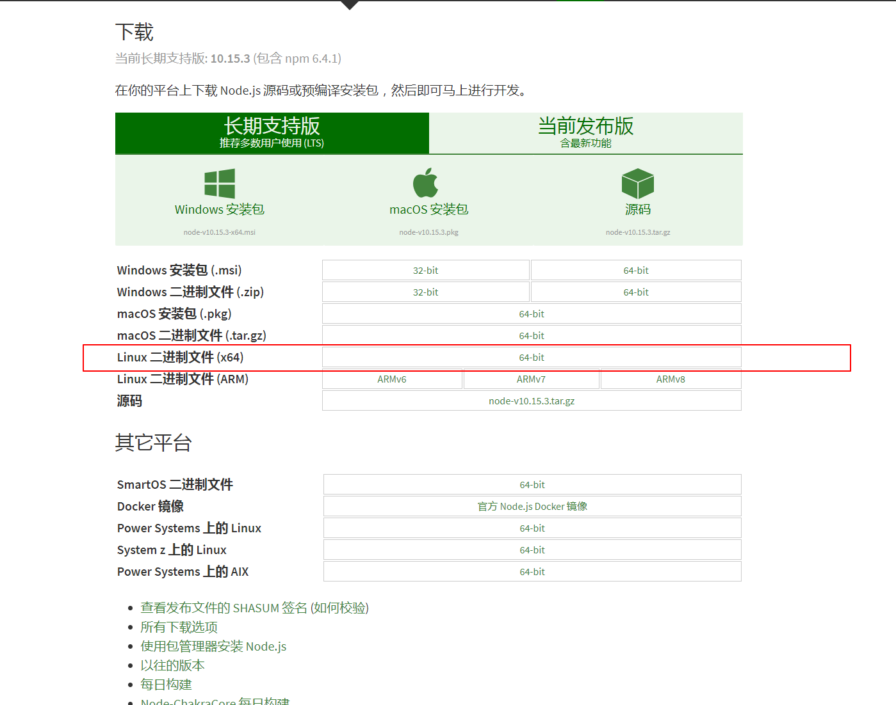
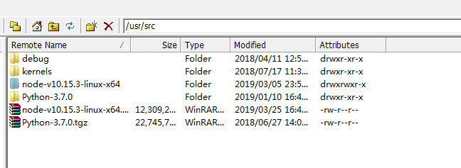

## 1.安装node 下载地址:
> 下载地址: https://nodejs.org/zh-cn/download/
- [下载页面](https://nodejs.org/zh-cn/download/)     --版本选择  node-v10.15.3-linux-x64.tar



下载 node-v10.15.3-linux-x64.tar.xz 至 /user/src 目录下


## 2.创建软链接，使node和npm命令全局有效(通过创建软链接的方法，使得在任意目录下都可以直接使用node和npm命令)  分别执行下面两条命令

```
ln -s /usr/src/node-v10.15.3-linux-x64/bin/node /usr/local/bin/node
ln -s /usr/src/node-v10.15.3-linux-x64/bin/npm /usr/local/bin/npm

```

## 3.将项目文件移动到相关目录下